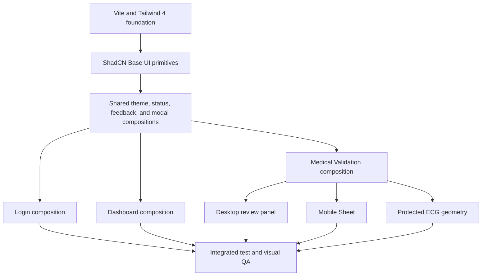
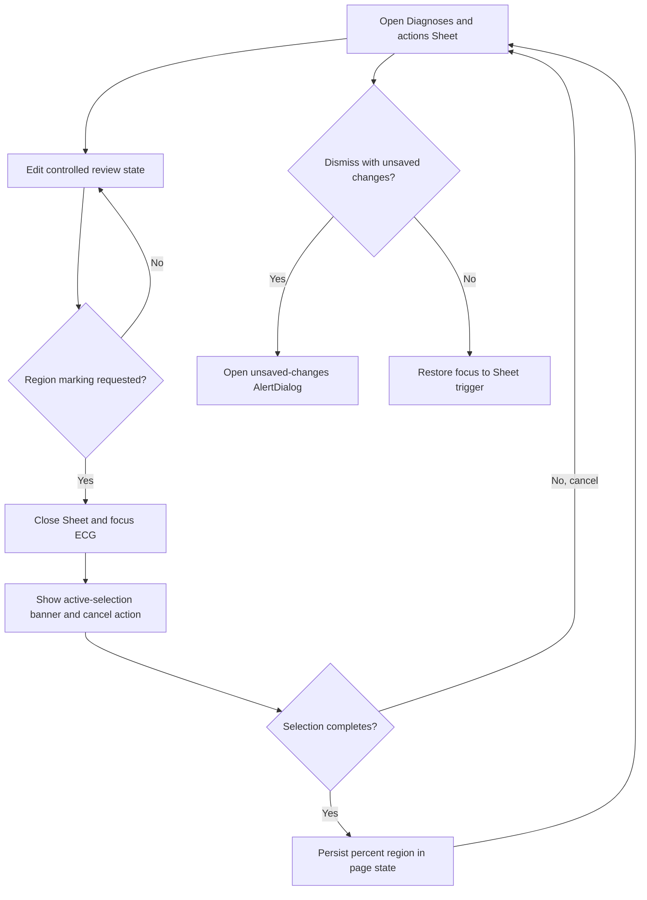
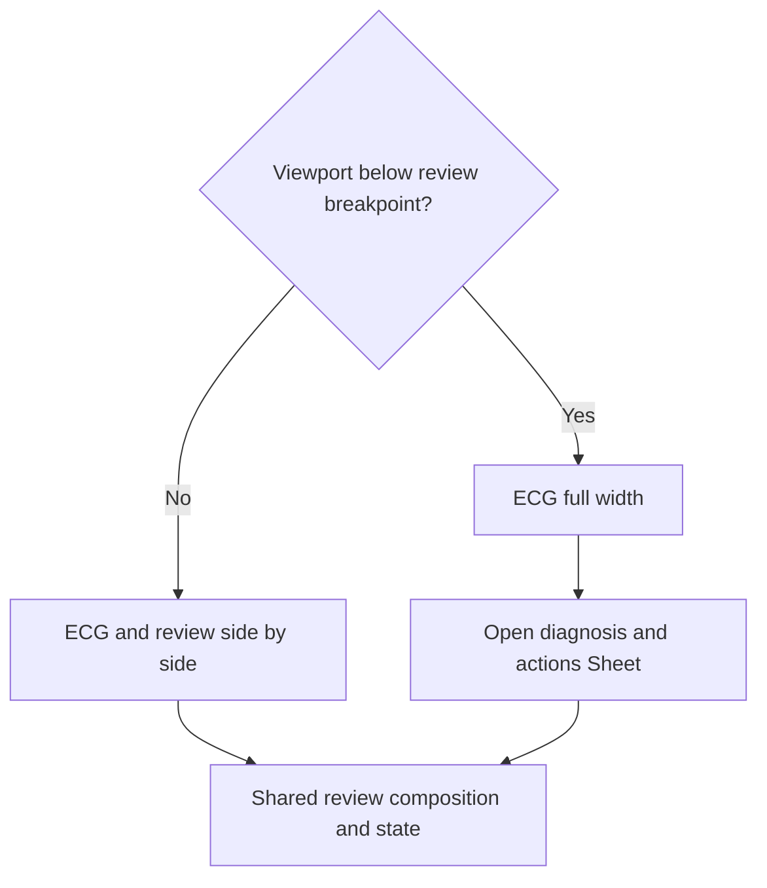

# ShadCN Design System Migration - Plan

## Goal Capsule

- **Objective:** Medical validators can use a consistent, accessible, responsive interface without regressions in authentication, queue handling, clinical decisions, or ECG inspection.
- **Means:** Replace the frontend presentation layer with ShadCN Base UI/Nova, Tailwind CSS 4, semantic tokens, and composed primitives while preserving domain contracts (KTD1-KTD6).
- **Authority:** This plan and the user-approved visual concepts govern the frontend result. Existing HTTP, route, authentication, clinical, and ECG contracts remain authoritative for behavior.
- **Execution profile:** Frontend-only refactor on `refactor/shadcn-design-system`, with foundation first and isolated Login, Dashboard, and Medical Validation workstreams after that foundation is committed.
- **Stop conditions:** Stop if the migration requires backend, CI/CD, clinical-rule, route, payload, or API changes, or if an existing public component contract cannot be preserved without user direction.
- **Tail ownership:** Deliver one pull request to `main`. Do not merge it automatically.

---

## Product Contract

### Summary

Refactor the existing React/Vite frontend into a cohesive ShadCN Base UI/Nova interface. Preserve all user flows and clinical behavior while modernizing Login, Dashboard, Medical Validation, mobile review, dialogs, and dark theme.

### Problem Frame

The frontend currently relies on a large global stylesheet, manual controls, and page-specific visual conventions. This makes behavior-preserving interface changes fragile, obscures accessibility guarantees, and duplicates work for responsive and dark-theme states.

The migration must improve consistency without changing what the system does. ECG fidelity and clinical review behavior are safety-sensitive and therefore remain protected domain surfaces.

### Requirements

**Foundation and compatibility**

- R1. Configure ShadCN Base UI with the Nova preset, JavaScript, Lucide, Tailwind CSS 4, CSS variables, and the official pointer option in the existing Vite application.
- R2. Keep `src/styles/global.css` as the only global stylesheet and limit its final contents to framework imports, semantic tokens, base rules, and strictly geometric ECG rules.
- R3. Support browsers that meet Tailwind CSS 4's official minimum versions: Chrome 111, Safari 16.4, and Firefox 128.
- R4. Preserve routes `/login`, `/`, and `/exams/:id`, all HTTP contracts, service APIs, authentication behavior, payloads, and clinical rules.
- R5. Preserve the public `ThemeContext` value shape and `medpage.theme` key while moving theme application from `data-theme` to the `.dark` class.

**Design-system composition**

- R6. Add only the approved ShadCN primitives and compose their interface chrome without `data-slot` overrides, `!important`, direct color literals, or manual `dark:` color overrides; existing dynamic clinical-overlay palettes are preserved as protected ECG data visualization.
- R7. Implement additional clinical states as named CVA variants backed by semantic design tokens.
- R8. Use Base UI composition contracts correctly, including `render` triggers, `nativeButton={false}` links, `Select` items, and array-valued controlled `ToggleGroup` state.
- R9. Preserve accessible names, keyboard navigation, focus visibility, Escape handling, focus restoration, loading states, validation messages, and disabled-state semantics.

**Login**

- R10. Recompose Login with ShadCN form primitives while preserving credential validation, credential-only trimming, duplicate-submit prevention, local recovery, institutional logos, and the inert alternative method.
- R11. Stack the institutional panel and form on narrow screens without reducing form clarity or keyboard usability.

**Dashboard**

- R12. Preserve queue grouping, queue priority, search, combinable filters, four-item pagination, next-exam start, summary filters, and the collapsible summary panel.
- R13. Present the queue as Item/Card compositions with icon tooltips, a daily progress Card, InputGroup search, active-filter Badges, and a controlled ToggleGroup.
- R14. Do not introduce a table, patient data that is not already present, or a new navigation rail.

**Medical Validation**

- R15. Preserve the single static daily diagnosis, optional-diagnosis workflow, general revalidation, agreement and disagreement decisions, region requirements, and all save/validate actions.
- R16. Replace manual modals with Dialog and unsaved-exit handling with AlertDialog while preserving their outcomes and focus behavior.
- R17. Reuse one review composition across desktop and mobile so responsive presentation does not duplicate clinical state.
- R18. Below `768px`, give the ECG full width and expose diagnosis and actions through a scrollable Sheet with fixed actions, `44px` minimum touch targets, safe-area padding, and scroll clearance for the action footer.
- R19. Preserve `EcgViewer` props, image proportions, no-crop behavior, zoom range `0.6` to `2.4`, zoom step `0.15`, pointer behavior, percent coordinates, region overlays, and responsive sidebar calculations for desktop widths at or above `768px`.
- R20. Migrate only the ECG toolbar, buttons, tooltips, and badges to ShadCN primitives; do not change image rendering or clinical overlays.

**Delivery and cleanup**

- R21. Remove replaced legacy CSS, deprecated theme selectors, unused components, status metadata coupled to visual classes, unused dependencies, imports, scripts, screenshots, and temporary artifacts.
- R22. Update the README with the actual frontend stack, supported browser baseline, and verified commands.
- R23. Preserve `public/logos/logo-bp-footer.png` as an untracked local file: do not use, delete, stage, or include it.
- R24. Deliver the work as one pull request from `refactor/shadcn-design-system` to `main`, with no automatic merge and no backend or CI/CD changes.

### Key Decisions

- **Use ShadCN Base UI with the Nova preset.** (session-settled: user-directed — chosen over Radix-based or legacy styling: the user selected the current Base UI stack.) Governs R1, R6, R8.
- **Perform a broad visual redesign while preserving behavior.** (session-settled: user-directed — chosen over incremental visual evolution: the user approved full-screen concepts for Login, Dashboard, Medical Validation, mobile, and dark theme.) Governs R4, R9-R20.
- **Use Tailwind CSS 4's modern browser baseline.** (session-settled: user-approved — chosen over a Tailwind 3 legacy baseline: the official Tailwind 4 compatibility floor was accepted.) Governs R1, R3.
- **Use an ECG-first Sheet layout on small screens.** (session-settled: user-directed — chosen over a persistent split or stacked review layout: the user prioritized ECG visibility.) Governs R17-R20.
- **Keep the footer logo outside the change.** (session-settled: user-directed — chosen over adding or deleting the untracked asset: the user asked to preserve it locally.) Governs R23.
- **Isolate this work from backend and CI/CD.** (session-settled: user-directed — chosen over a cross-stack migration: the user restricted the change to the frontend.) Governs R4, R24.

### Acceptance Examples

- AE1. Covers R10-R11. Given a user submits valid credentials once, when authentication succeeds, then the existing route transition occurs without a second request and the narrow layout remains operable by keyboard.
- AE2. Covers R12-R14. Given combined search and status filters, when the user pages the queue, then the same prioritized filtered exams appear four at a time and the next-exam action opens the correct exam.
- AE3. Covers R15-R16. Given a disagreement requiring clinical regions, when the user attempts to validate without the required regions, then accessible feedback blocks validation; adding valid regions allows the existing validation outcome.
- AE4. Covers R17-R20. Given a 390 by 844 viewport, when the review opens, then the ECG uses the full content width without crop or distortion and one Sheet controls the same diagnosis state and actions as desktop.
- AE5. Covers R5-R9. Given the stored theme is dark, when any route loads, then `.dark` is applied before interaction and all controls retain visible focus, readable states, and semantic tokens.

### Success Criteria

- All existing and new behavioral tests pass without retaining legacy classes solely for assertions.
- Rendered QA passes at 1440×900, 920 px, 767 px, and 390×844 in light and dark themes.
- ECG screenshots show no crop, deformation, layout-generated white bands, or regressions in zoom and region placement.
- The final diff contains no backend, CI/CD, concept image, temporary screenshot, or preserved-logo changes.
- Bundle comparison and browser compatibility are documented in the pull request.
- The pull request remains unmerged until a representative medical validator can accept the core desktop and mobile workflow; this human acceptance is a merge gate, not an automated implementation gate.

### Scope Boundaries

**In scope**

- React/Vite components, tests, frontend configuration, semantic design tokens, README, and generated ShadCN source components that have active consumers.

**Outside this work**

- Backend code, APIs, database behavior, clinical decision rules, authentication contracts, deployment configuration, CI/CD branches, and automatic merge.
- Concept images and local QA screenshots in the repository.

---

## Planning Contract

### Key Technical Decisions

- KTD1. **Initialize the existing Vite app through the official ShadCN workflow.** (session-settled: user-directed — chosen over recreating the application or using a different preset: the migration must preserve the current project and use Base UI/Nova.) Extend the current build instead of replacing its routing or services. Governs R1-R4, R6, R8.
- KTD2. **Own visual semantics through Tailwind theme tokens and source-level CVA variants.** (session-settled: user-approved — chosen over CSS overrides: the user prohibited overrides and approved semantic clinical variants.) Keep stock primitives recognizable and add only domain variants required by consumers. Governs R2, R6-R7.
- KTD3. **Preserve ThemeContext externally and replace its DOM mechanism internally.** Use `.dark` on the document root and retain persisted values and public methods. Governs R5, R9.
- KTD4. **Separate shared foundation from page work.** Commit configuration, tokens, primitives, theme, shared dialogs, and shared state components before parallel page migration. Governs R1-R9, R16.
- KTD5. **Keep ECG domain geometry isolated from component styling.** ShadCN owns chrome; existing calculations and image/overlay geometry remain direct, testable rules. Governs R18-R20.
- KTD6. **Use one controlled review composition with responsive containers.** `ExamReviewPage` owns diagnosis selection, disagreement draft, selected regions, optional-panel state, notes, dirty state, and action progress so switching between desktop and Sheet cannot lose clinical state. Desktop renders the controlled composition beside ECG; mobile renders it in Sheet. Governs R15-R18.
- KTD7. **Test behavior through roles, accessible names, state, and outcomes.** Replace legacy-class assertions unless a class encodes protected ECG geometry. Governs R9-R20.
- KTD8. **Use pinned Playwright Chromium with temporary intercepted APIs for browser QA.** Keep the runner in development dependencies, keep synthetic fixtures and screenshots outside the repository, install Chromium through the pinned CLI, and inspect every published screenshot for identifiers. Governs R21, R24.

### High-Level Technical Design

### Visual Reference Contract

The concept files remain outside the repository. The current execution session retains the five approved artifacts, while this contract preserves the visual hierarchy that future reviewers must compare when those external artifacts are reattached.

| Reference | Target | Protected visual cues |
|---|---|---|
| Login light | Desktop and narrow stack | Institutional navy identity panel; BP and NSEE marks; ECG line motif; dominant access Card; recovery Collapsible and inline error Alert. |
| Dashboard light | Wide desktop | Navy global header; single daily progress strip; queue-dominant content area; compact active-filter row; right summary panel with outlined selected states. |
| Medical Validation light | Wide desktop | Narrow fixed review rail; ECG-dominant canvas; compact top metadata; static daily diagnosis Card; equal action buttons fixed below the rail. |
| Medical Validation mobile | 767 px and 390×844 | Full-width ECG; persistent Diagnoses and actions trigger; right Sheet with scrollable review content and fixed equal action footer. |
| Medical Validation dark | Wide desktop | Deep navy surfaces from semantic tokens; white ECG paper remains unchanged; clinical green, warning, and active blue states retain contrast and hierarchy. |

### Route State Matrix

- **Login:** idle, field-invalid, authentication pending, authentication failure, recovery expanded, and authenticated redirect retain current copy, one-request behavior, and focus association.
- **Dashboard:** initial loading uses Skeleton, service failure uses Alert with current recovery, unfiltered empty and filtered empty use distinct Empty compositions, and pagination/loading actions preserve current availability rules.
- **Medical Validation:** exam loading, unavailable exam, ECG loading/fallback, validation warning, save pending/success/failure, unsaved exit, and region-selection mode preserve current callbacks, copy, retry path, and dirty-state behavior.

### Assumptions

- The official ShadCN CLI version available during implementation supports the requested Base UI/Nova preset and all named primitives; generated source will be reviewed before use.
- Existing public component contracts can be retained while internal markup changes. If a generated primitive conflicts with a protected contract, composition will adapt at the page boundary instead of changing domain behavior.
- Visual concepts are external reference targets governed by the Visual Reference Contract. Existing logos already tracked by the project remain the only shipped image assets used by the redesign.

### Sequencing

1. Capture the pre-migration production bundle sizes from the merged `main` baseline, including raw and compressed assets.
2. Establish and commit the build, token, primitive, theme, and shared-component foundation.
3. Migrate Login, Dashboard, and Medical Validation in parallel with exclusive file ownership.
4. Integrate shared seams, remove legacy code, update documentation, and run the complete verification contract.
5. Repeat the same bundle measurement, perform behavioral review, browser QA, final cleanup, bundle comparison, and pull-request delivery.

### Risks and Mitigations

- **Base UI API mismatch:** Inspect official component docs before each add group and review generated files; cover render-prop, link, Select, and ToggleGroup contracts in tests.
- **Behavior hidden in legacy markup or CSS:** Add characterization coverage before replacing weakly tested surfaces and compare outcomes, not implementation classes.
- **ECG quality regression:** Keep geometry isolated, retain existing calculations, and validate several natural aspect ratios and zoom boundaries in automated and rendered tests.
- **Responsive state duplication:** Use one review state owner and inject its composition into desktop or Sheet containers.
- **Global CSS residue:** Audit selectors, color literals, `!important`, old class consumers, and generated artifacts before delivery.

---

## Implementation Units

### U1. Establish the ShadCN and Tailwind foundation

- **Goal:** Make the existing Vite application compile with the approved Base UI/Nova design-system foundation.
- **Requirements:** R1-R8, R23-R24; KTD1-KTD4.
- **Dependencies:** None.
- **Files:** `package.json`, `package-lock.json`, `vite.config.js`, `jsconfig.json`, `components.json`, `src/styles/global.css`, `src/lib/utils.js`, `src/context/ThemeContext.jsx`, `src/components/ui/*`, `tests/ThemeContext.test.jsx`.
- **Approach:** Initialize the official configuration; add Accordion, Alert, AlertDialog, Badge, Button, Card, Checkbox, Collapsible, Dialog, Empty, Field, Input, InputGroup, Item, Progress, ScrollArea, Select, Separator, Sheet, Skeleton, Spinner, Textarea, ToggleGroup, and Tooltip in documented groups; review generated source; establish semantic tokens; migrate theme internals; and keep the preserved local logo outside Git.
- **Execution note:** Prefer install, build, and theme smoke proof before page migration; add characterization coverage for the public theme contract first.
- **Patterns to follow:** Existing Vite entry points and public ThemeContext API; official ShadCN Vite and component documentation.
- **Test scenarios:**
  - A stored light or dark preference yields the same public context values and applies or removes `.dark` on the document root.
  - A theme toggle persists `medpage.theme` and remains stable across remount.
  - Every approved primitive renders from reviewed generated source, and Button, Select, ToggleGroup, Dialog, AlertDialog, Sheet, and Tooltip satisfy their Base UI interaction contracts.
- **Verification:** The application installs, tests, and builds with the new foundation before page work begins; only frontend configuration, tokens, primitives, theme, and foundation tests are in the foundation commit.

### U2. Build shared application compositions

- **Goal:** Replace shared manual UI patterns with reusable ShadCN compositions that page work can consume.
- **Requirements:** R6-R9, R16, R21; KTD2-KTD4, KTD7.
- **Dependencies:** U1.
- **Files:** `src/components/AppHeader.jsx`, `src/components/StatusBadge.jsx`, `src/components/EmptyState.jsx`, `src/components/LoadingState.jsx`, `src/components/SupportContactModal.jsx`, `src/components/TutorialModal.jsx`, `src/components/UnsavedChangesModal.jsx`, `src/utils/queueSemantics.js`, `src/utils/statusLabels.js`, `src/components/ui/*`, `tests/AppHeader.test.jsx`, `tests/Dialogs.test.jsx`.
- **Approach:** Compose icon actions with Tooltip, semantic status variants with Badge/CVA, feedback and loading primitives, Dialog for ordinary modals, and AlertDialog for unsaved exit.
- **Execution note:** Add dialog focus, Escape, and restoration characterization tests before replacing manual modal markup.
- **Patterns to follow:** Base UI `render` composition and accessible naming; existing modal handlers and callbacks.
- **Test scenarios:**
  - Each icon-only action exposes an accessible name and Tooltip without duplicate interactive elements.
  - Dialog opens, traps focus, closes on Escape where allowed, and restores focus to its trigger.
  - Unsaved-exit AlertDialog separates cancel and destructive confirmation and invokes the existing callbacks once.
  - Named status variants render equivalent clinical meaning in light and dark themes without raw color classes.
- **Verification:** Shared components have active consumers or are removed; no shared manual overlay or legacy status-style metadata remains.

### U3. Migrate Login

- **Goal:** Deliver the approved institutional Login composition without changing authentication behavior.
- **Requirements:** R9-R11; AE1; KTD2, KTD7.
- **Dependencies:** U1, U2.
- **Files:** `src/pages/LoginPage.jsx`, `tests/LoginPage.test.jsx`.
- **Approach:** Compose the form with Card, FieldGroup, Field, InputGroup, Checkbox, Collapsible, Alert, Separator, and Button; retain institutional identity through tracked assets and utility layout.
- **Execution note:** Preserve and extend characterization tests before removing legacy markup.
- **Patterns to follow:** Existing AuthContext and auth service calls; shared alert and loading semantics from U2.
- **Test scenarios:**
  - Empty or invalid credentials show the existing field and form feedback through accessible associations.
  - Credential whitespace is trimmed while the password value is submitted unchanged.
  - Repeated submit while pending produces one authentication request and one navigation outcome.
  - Recovery details expand and collapse by keyboard without submitting the form.
  - The alternative method remains inert and does not initiate authentication.
- **Verification:** Login behavior matches existing tests and the approved desktop/narrow concepts in both themes.

### U4. Migrate Dashboard

- **Goal:** Deliver the approved queue-focused Dashboard composition without changing queue semantics.
- **Requirements:** R9, R12-R14; AE2; KTD2, KTD7.
- **Dependencies:** U1, U2.
- **Files:** `src/pages/DashboardPage.jsx`, `src/components/ActiveFiltersBar.jsx`, `src/components/ExamFilters.jsx`, `src/components/ExamList.jsx`, `src/components/ExamCard.jsx`, `src/components/ValidationSummaryPanel.jsx`, `src/components/QuickMetricItem.jsx`, `tests/DashboardPage.test.jsx`, `tests/ValidationSummaryPanel.test.jsx`.
- **Approach:** Use a progress Card, InputGroup search, active-filter Badges, controlled ToggleGroup summary filters, and Item/Card queue entries while retaining existing utility functions and service boundaries.
- **Execution note:** Characterize combined filters, pagination, priority, and next-exam behavior before replacing layout.
- **Patterns to follow:** `src/utils/queueSemantics.js`, `src/utils/statusLabels.js`, and existing dashboard service inputs and outputs.
- **Test scenarios:**
  - Search, one queue-state selection, one decision refinement, and one region refinement combine without changing priority ordering; Base UI arrays wrap the single selected value rather than enabling multi-state selection.
  - Active-filter badges remove only their own filter and clear-all resets the same state.
  - Pagination exposes four filtered exams per page and correct boundary controls.
  - Starting the next exam selects the highest-priority eligible exam and navigates to its current route.
  - Summary ToggleGroup uses array state and the collapsible panel retains its selection when reopened.
- **Verification:** Queue data and actions match current behavior; no table, extra patient data, or navigation rail appears.

### U5. Migrate Medical Validation and ECG chrome

- **Goal:** Deliver the approved desktop, mobile Sheet, and dark Medical Validation experience while preserving clinical and ECG behavior.
- **Requirements:** R9, R15-R20; AE3-AE5; KTD2, KTD5-KTD7.
- **Dependencies:** U1, U2.
- **Files:** `src/pages/ExamReviewPage.jsx`, `src/components/DiagnosisPanel.jsx`, `src/components/ReviewActions.jsx`, `src/components/EcgViewer.jsx`, `src/components/PatientInfo.jsx`, `src/utils/reviewLayout.js`, `tests/DiagnosisPanel.test.jsx`, `tests/ReviewActions.test.jsx`, `tests/EcgViewer.test.jsx`, `tests/ExamReviewPage.test.jsx`, `tests/reviewLayout.test.js`.
- **Approach:** Use Card for the daily diagnosis, Collapsible for optional diagnoses, Accordion for clinical details, controlled ToggleGroup for decisions, Select for additions, Alert for feedback, Button for actions, and one controlled review composition rendered in desktop or Sheet containers. A persistent mobile trigger opens the right Sheet. Starting region marking closes the Sheet, exposes selection and cancel feedback over the ECG, then restores the Sheet and its prior state when selection completes or is cancelled. Dirty dismissals route through AlertDialog with focus restored to the trigger. Restrict EcgViewer changes to its chrome.
- **Execution note:** Add page-flow and modal characterization coverage first; keep ECG geometry assertions throughout the migration.
- **Patterns to follow:** Existing diagnosis reference, disagreement, region visual, and sidebar-layout utilities; existing action handlers and service calls.
- **Test scenarios:**
  - Exactly one daily diagnosis is present and has no add control; optional diagnoses remain addable only through their Select.
  - Agreement, disagreement, required-region feedback, save, save-and-next, validation, and back behavior invoke current handlers with unchanged payloads.
  - Unsaved navigation opens AlertDialog and preserves or discards state according to the chosen action.
  - At 767 px and 390×844, ECG is full width and one Sheet exposes the same diagnosis values and actions with fixed action access.
  - Zoom stops at `0.6` and `2.4`, changes by `0.15`, and reset/fit-to-screen returns to zoom `1` without introducing browser Fullscreen API behavior.
  - Images with different natural ratios remain centered without crop or distortion; percent-based clinical regions remain aligned while zooming and resizing.
- **Verification:** Desktop and mobile workflows, ECG fidelity, light/dark themes, long text, keyboard navigation, and focus behavior match the product contract.

### U6. Integrate, remove legacy code, and document delivery

- **Goal:** Leave a minimal, verified ShadCN frontend and a reviewable pull request.
- **Requirements:** R2-R3, R6, R21-R24; all acceptance examples; KTD7-KTD8.
- **Dependencies:** U3-U5.
- **Files:** `src/styles/global.css`, `src/pages/LoginPage.jsx`, `src/pages/DashboardPage.jsx`, `src/pages/ExamReviewPage.jsx`, `src/components/*.jsx`, `src/context/ThemeContext.jsx`, `src/utils/queueSemantics.js`, `src/utils/statusLabels.js`, `tests/*.test.js`, `tests/*.test.jsx`, `README.md`, `package.json`, `package-lock.json`.
- **Approach:** Integrate page work, remove unused components and legacy classes, eliminate raw styling and dead dependencies, update behavior-focused tests, document actual commands and compatibility, and perform external temporary browser QA with intercepted APIs.
- **Execution note:** Run cleanup after behavior is green, then review the entire diff and repeat high-risk browser flows.
- **Patterns to follow:** Repo scripts and official Tailwind/ShadCN compatibility guidance; temporary Playwright artifacts outside the repository.
- **Test scenarios:**
  - Every route renders in light and dark themes without console errors at the four target viewport sizes.
  - Focus order, keyboard activation, Escape, focus restoration, disabled actions, loading indicators, and long text remain usable.
  - Intercepted synthetic API fixtures exercise Login, queue start, diagnosis decisions, save, save-and-next, validation, and unsaved exit without backend or production-derived patient data.
  - Unauthenticated access to `/` and `/exams/:id` redirects to `/login`; authenticated access to `/login` redirects away; protected content does not render during session validation; and a `401` clears the stored session before returning to Login.
  - Static audit finds no forbidden overrides, legacy theme attribute, direct interface-color literals, unused legacy components, or repository screenshots; protected dynamic region palettes in `src/utils/diagnosisRegionVisuals.js` are excluded from the interface-color rule.
- **Verification:** All verification gates pass, the diff is frontend-only, the preserved logo remains untracked, and the pull request records visual evidence, compatibility, tests, and bundle comparison.

---

## Verification Contract

| Gate | Command or evidence | Completion signal |
|---|---|---|
| Unit and component tests | `npm test` | All tests pass without legacy-class-only assertions. |
| UI tests | `npm run test:ui -- --maxWorkers=1 --fileParallelism=false` | All UI-oriented tests pass without hangs. |
| Production build | `npm run build` | Vite completes and bundle sizes are captured for comparison. |
| Dependency integrity | `npm ls` | No invalid or extraneous dependency tree entries. |
| Reproducible install | `npm ci` | The committed lockfile installs without mutation. |
| Dependency security | `npm audit --audit-level=high` | No unresolved high or critical advisory affects the build or browser bundle; any accepted exception is documented with owner and expiry. |
| Patch hygiene | `git diff --check` | No whitespace errors. |
| Static cleanup | Targeted `rg` audits | No `data-theme`, `!important`, `data-slot` override selectors, forbidden interface colors, obsolete consumers, or tracked temporary screenshots; protected dynamic ECG overlay palettes remain intact. |
| Rendered QA | Pinned Playwright Chromium with temporary synthetic API interception | Login, Dashboard, and Medical Validation pass at 1440×900, 920 px, 767 px, and 390×844 in light and dark; no captured identifier is published. |
| Visual fidelity | Final screenshots inspected beside approved concept images with `view_image` | At least five fidelity observations per screen are recorded, including ECG fidelity. |
| Scope audit | Git status and diff review | No backend, CI/CD, concept-image, or preserved-logo change is included. |

---

## Definition of Done

- U1-U6 meet their verification outcomes and all cited acceptance examples pass.
- Login, Dashboard, and Medical Validation use the approved ShadCN Base UI/Nova primitives and semantic tokens.
- Public routes, ThemeContext API, storage key, HTTP contracts, service behavior, clinical rules, EcgViewer props, zoom, coordinates, regions, and image proportions remain compatible.
- The mobile Sheet reuses the desktop review state and preserves accessible fixed actions.
- `src/styles/global.css` contains only framework imports, semantic tokens, base rules, and ECG geometry.
- Replaced CSS, unused components, legacy theme selectors, forbidden overrides, raw styling, dead imports, dependencies, scripts, screenshots, and abandoned experimental code are removed.
- README and pull-request notes describe the real stack, commands, compatibility, visual evidence, bundle comparison, and frontend-only scope.
- The pull request is ready for representative medical-validator acceptance of the desktop and mobile core flow; the user retains the merge decision.
- `public/logos/logo-bp-footer.png` remains untracked and untouched.
- The branch is published and one pull request targets `main`; it is not merged automatically.
